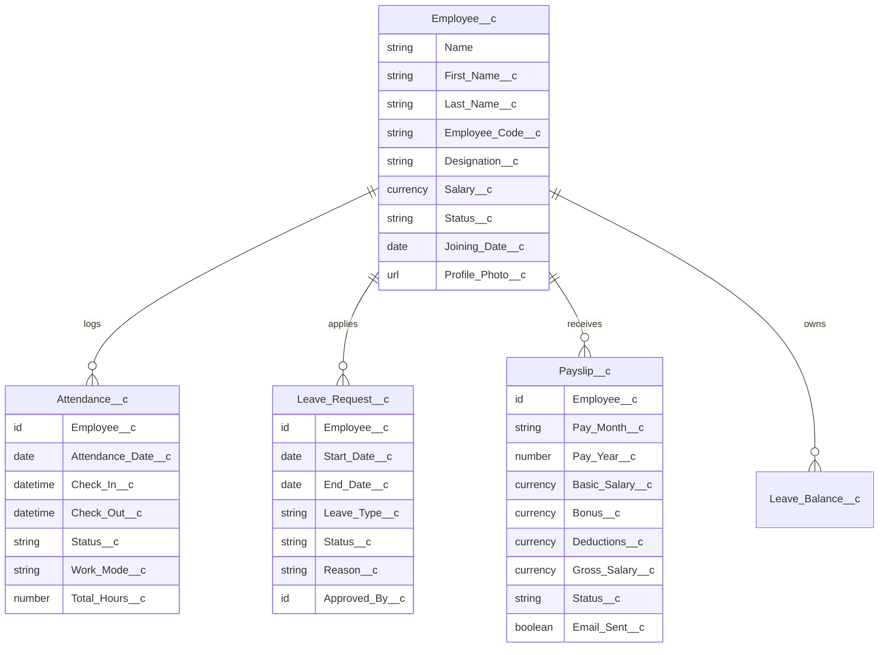

# HRMS - Salesforce Workforce Management System

An enterprise-grade **Human Resource Management System (HRMS)** built natively on the Salesforce Platform using Apex, Lightning Web Components (LWC), and Salesforce DX.

---

## 🌟 Application Features

- **Centralized Workforce Dashboard (`c-dashboard`)**: Real-time KPI metrics, active employee counts, payroll summaries, attendance tracking, and pending leave approvals.
- **Employee Directory (`c-employee-management`)**: Complete lifecycle employee management, profile photo uploads with Salesforce Files integration, contact details, designations, and salary records.
- **Attendance Tracker (`c-attendance-management`)**: Daily employee check-in/check-out logs, work mode categorization (Office / Remote / Hybrid), and overtime tracking.
- **Leave Management Portal (`c-leave-request`)**: Leave request workflows (Casual, Sick, Paid, WFH, LOP) with real-time approval/rejection status tracking.
- **Payroll & Compensation (`c-payslip-management`)**: Salary ledger generation, automated Visualforce PDF statement rendering (`PayslipPDFPage.page`), and email distribution with PDF attachments (`SendPayslipEmailInvocable.cls`).
- **Analytics & Visual Reports (`c-reports-management`)**: Interactive data visualization powered by Chart.js (designation breakdown, status ratios, joining trends, and compensation distribution).
- **System Configuration (`c-settings-management`)**: Administrative preferences, approval policies, notification rules, and localization settings.

---

## 🏗️ Architecture & Data Model



---

## 🔐 Security & Access Control

- **Strict User Mode**: Queries enforce field and object-level permissions using `WITH USER_MODE`, `as user`, and `Security.stripInaccessible()`.
- **Sharing Architecture**: Explicit `with sharing` or `inherited sharing` on all service layers.
- **Permission Sets**:
  - `HRMS_Admin`: Full configuration, payroll, and roster management.
  - `HRMS_Manager`: Team attendance review and leave approval workflows.
  - `HRMS_Employee`: Self-service portal (personal attendance, leave filing, payslip access).
  - `HRMS_Payroll_Access`: Dedicated finance/payroll operational permissions.

---

## 🚀 Deployment & Testing

### 1. Deploy Metadata to Org
```bash
sf project deploy start --target-org HrmsOrg
```

### 2. Run Test Suite
```bash
sf apex run test --test-level RunLocalTests --target-org HrmsOrg --result-format human --code-coverage
```

### 3. Assign Permissions
```bash
sf org assign permset --name HRMS_Admin --target-org HrmsOrg
```
